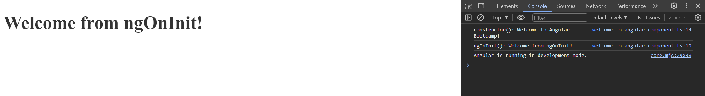

# Components

Components are the building blocks of a web application. They are **reusable** and can be used in different parts of the application.

Create a new component by running the following command:

```bash
ng generate component welcome-to-angular
```

This command will create a new folder in the `src/app` directory with the name `welcome-to-angular`. Inside this folder, you will find the following files:

- `welcome-to-angular.component.css`
- `welcome-to-angular.component.html`
- `welcome-to-angular.component.spec.ts`
- `welcome-to-angular.component.ts`

Note that you can also create a component using the shorthand `ng g c welcome-to-angular`.

## Modify the component

Suppose we want to create a component that displays a welcome message linked to a variable in our TypeScript code, we would modify the component in this way:

_welcome-to-angular.component.ts_

```typescript
export class WelcomeToAngularComponent {
  message = "Welcome to Angular Bootcamp!";
}
```

_welcome-to-angular.component.html_

```html
<h1 class="welcome-title">{{ message }}</h1>
```

_welcome-to-angular.component.css_

```css
.welcome-title {
  font-size: 42px;
  color: #333;
}
```

## Display

To display the component in the application, we need to add the **selector** of the component to the `app.component.html` file:

_app.component.html_

```html
<app-welcome-to-angular></app-welcome-to-angular>
```

But is not enough! We need to import the component in the `app.component.ts` file:

_app.component.ts_

```typescript
@Component({
  selector: 'app-root',
  standalone: true,
  imports: [WelcomeToAngularComponent],
  templateUrl: './app.component.html',
  styleUrl: './app.component.css',
})
```

Restart the application and you should see the welcome message displayed in the browser.


## Component Lifecycle

Angular components have a defined lifecycle managed by specific lifecycle hooks, allowing developers to tap into key moments in the life of a component. Here’s an overview of the primary lifecycle hooks available:

- `ngOnInit`: Called after the component has been initialized.
- `ngOnChanges`: Called when the component's input properties change.
- `ngDoCheck`: Called during every change detection run.
- `ngAfterContentInit`: Called after the component's content has been initialized.
- `ngAfterContentChecked`: Called after the component's content has been checked.
- `ngAfterViewInit`: Called after the component's view has been initialized.
- `ngAfterViewChecked`: Called after the component's view has been checked.
- `ngOnDestroy`: Called just before the component is destroyed.

_More details about the lifecycle hooks can be found [here](https://angular.io/guide/lifecycle-hooks)._

To see how these hooks can be implemented, consider this simple example:

```typescript
export class WelcomeToAngularComponent {
  message = "Welcome to Angular Bootcamp!";

  constructor() {
    console.log(`constructor(): ${this.message}`);
  }

  ngOnInit() {
    this.message = "Welcome from ngOnInit!";
    console.log(`ngOnInit(): ${this.message}`);
  }
}
```

In this example, the constructor prints the initial message when the component instance is created, and the ngOnInit hook modifies the message and logs it again.

Here's a screenshot of the console displaying the result:


### What Are Standalone Components?

- A standalone component is a type of component that doesn’t belong to any specific Angular module.
- In previous Angular versions, when you created a component, you typically had to include it in the declaration array of a module; otherwise, Angular would throw an error during compilation.
- However, with standalone components, this restriction is lifted, making component creation more flexible and streamlined.

### Key Features of Standalone Components:

- No NgModule Dependency: Standalone components don’t require Angular Modules (NgModule). They self-manage their dependencies.
- Lazy Loading: These components can be lazy loaded via Angular router, enhancing performance.

### [➡️ Next section: 02-angular-bootcamp-data-binding](https://github.com/davdifr/angular-bootcamp/tree/02-angular-bootcamp-data-binding)
